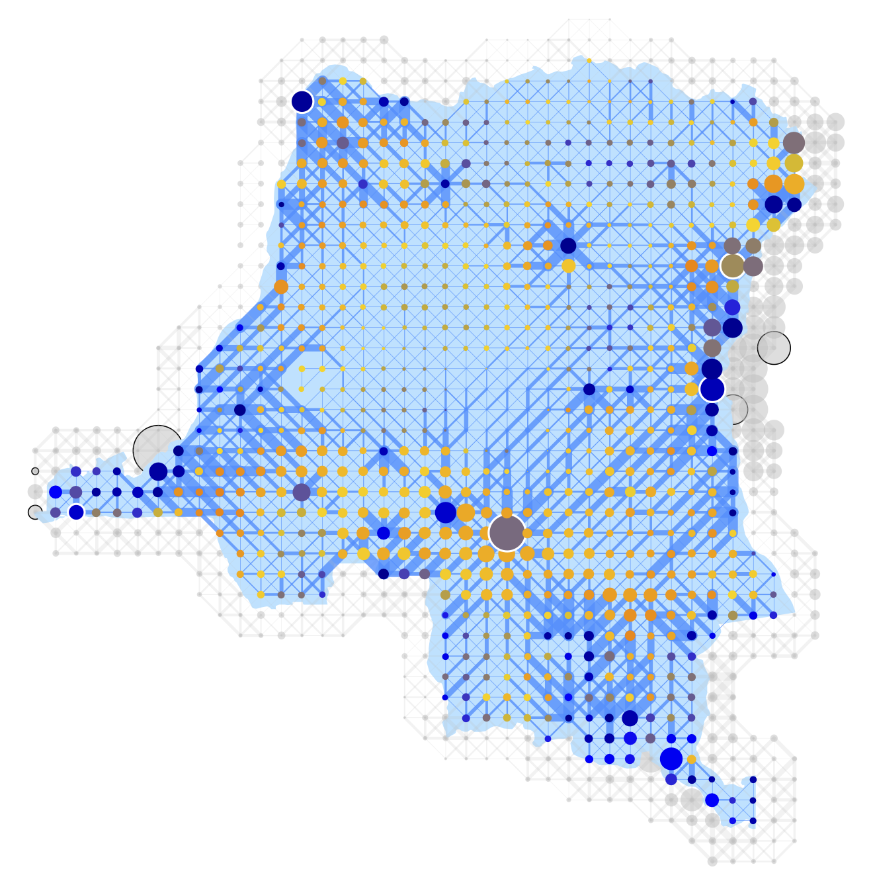
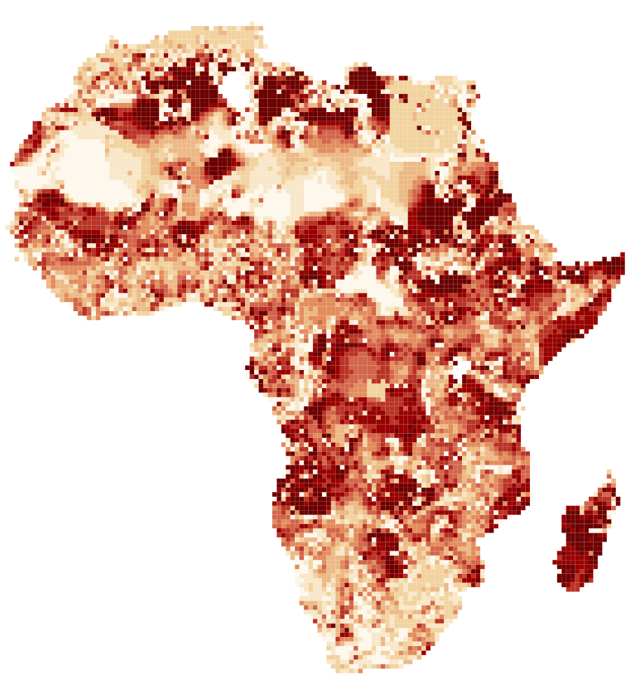
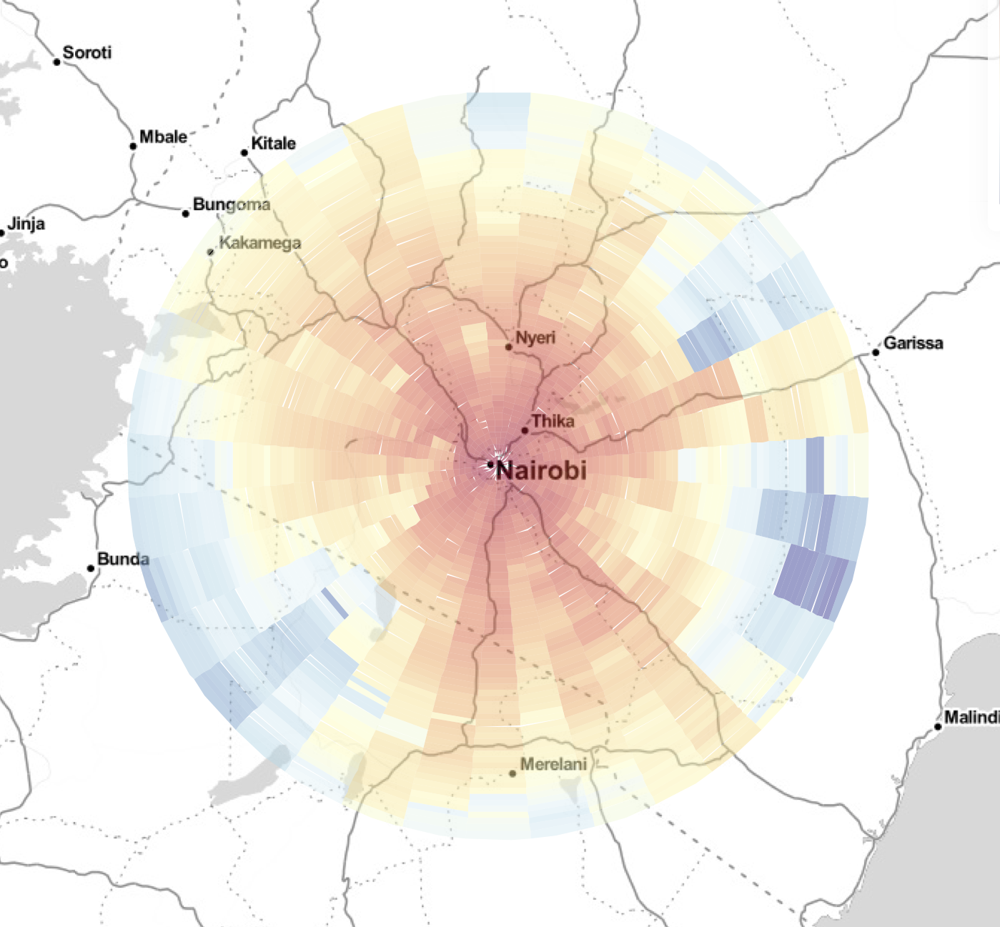

<link rel="stylesheet" href="styles.css" type="text/css">

 
1. Graff (2019). [**Spatial Inefficiencies in Africa's Trade Network**.](files/Graff 2019.pdf) *NBER Working Paper #25951*
 
I assess the effciency of transport networks for every country in Africa. Using rich spatial data, I simulate trade flows over more than 70,000 links covering the entire continent. I maximise over the space of networks and find the optimal road system for every African state. My simulations predict that Africa would gain 1.1% of total welfare from better organising its national road systems. I then construct a novel dataset of local network ineffciency and I find that colonial infrastructure projects significantly skew trade networks towards a sub-optimal equilibrium. I also find evidence for regional favouritism and ineffcient aid provision.
  
2. Graff and Haushofer (2019). **Psychological well-being is related to income, not inequality**. *Under Review*
  
3. Egger and Graff (2019). **iv_spatial_HAC**.
 
Stata package to compute Conley-type standard errors in 2SLS-settings. *Available upon request*.
