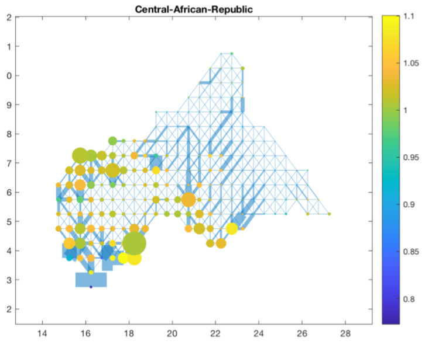

<link rel="stylesheet" href="styles.css" type="text/css">

 

[*Spatial Inefficiencies in Africa's Transport Network*](files/Spatial_Inefficiencies.pdf) - Working Paper, 2018
 
Are roads in Africa connecting the right places to promote beneficial trade? I assess the efficiency of transport networks for every country in Africa. Using rich data from satellites and online routing services, I simulate optimal trade flows over a comprehensive grid of more than 70,000 links covering the entire continent. I employ a recently established framework from the optimal transport in economics literature to maximise over the space of networks and find the optimal road system for every African state. Where would the social planner ideally build new roads and which roads are superfluous in promoting trade? My simulations predict that the entire continent would gain more than 1.1% of total welfare from better organising its national road systems. Comparing current and optimal networks, I then construct a novel dataset of local network inefficiency for more than 10,000 African grid cells. I analyse roots of the substantial imbalances present in this dataset. I find that colonial infrastructure projects from more than a century ago still persist in significantly skewing trade networks towards a sub-optimal equilibrium. Areas close to former colonial railroads have about 1.7% too much welfare given their position in the network. I also find evidence for regional favouritism, as the birthplaces of African leaders are overequipped with unnecessary roads. Lastly, I uncover a descriptive relationship whereby large transport infrastructure projects from The World Bank are not allocated to regions most in need of additional roads.